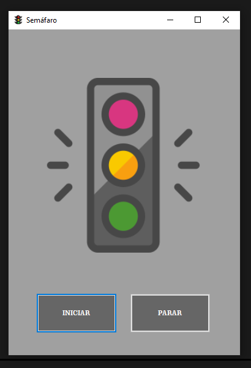

# 🚦 Simulador de Semáforo com C# e Windows Forms

Este projeto é um simulador simples de semáforo desenvolvido em C# utilizando o Windows Forms. Ele demonstra o uso de controles `PictureBox` para exibir imagens e `Timer` para controlar a troca de estados (cores) do semáforo em intervalos de tempo definidos.

---

## 📸 Captura de Tela

Aqui você pode ver uma imagem do simulador de semáforo em funcionamento:

---

## 🚀 Funcionalidades

* **Ciclo de Cores:** O semáforo alterna automaticamente entre as cores vermelho, verde e amarelo.
* **Tempo Definido:** Cada cor permanece ativa por 30 segundos.
* **Controle Manual:** Botões para **Iniciar** e **Parar** a simulação a qualquer momento.
* **Estado Inicial/Final:** O semáforo começa e retorna ao estado "desligado" ao ser parado.

---

## ✨ Como Usar

1.  **Clone ou Baixe o Projeto:** Obtenha o código-fonte deste repositório.
2.  **Abra no Visual Studio:** Abra o arquivo de solução (`.sln`) no Visual Studio.
3.  **Restaure os Pacotes NuGet (se necessário):** O Visual Studio geralmente faz isso automaticamente.
4.  **Execute o Projeto:** Pressione `F5` ou clique no botão "Iniciar" no Visual Studio.

Uma janela com o semáforo e os botões "Iniciar" e "Parar" será exibida:

* Clique em **"Iniciar"** para começar o ciclo do semáforo.
* Clique em **"Parar"** para interromper o ciclo e retornar o semáforo ao estado desligado.

---

## 📂 Estrutura do Projeto

* `Form1.cs`: Contém a lógica principal da aplicação, incluindo o controle do `Timer`, a troca de imagens e o tratamento dos eventos dos botões.
* `Form1.Designer.cs`: Código gerado automaticamente pelo Visual Studio, responsável pela criação e posicionamento dos controles na tela (PictureBox, Buttons, Timer).
* `Form1.resx`: Arquivo de recursos do formulário.
* `Program.cs`: Ponto de entrada da aplicação.
* `Resources/`: Pasta contendo as imagens utilizadas para representar os estados do semáforo:
    * `semafDesligado.png`
    * `semafVermelho.png`
    * `semafAmarelo.png`
    * `semafVerde.png`
---

## 🛠️ Tecnologias Utilizadas

* **C#**
* **Windows Forms (.NET Framework)**

---

